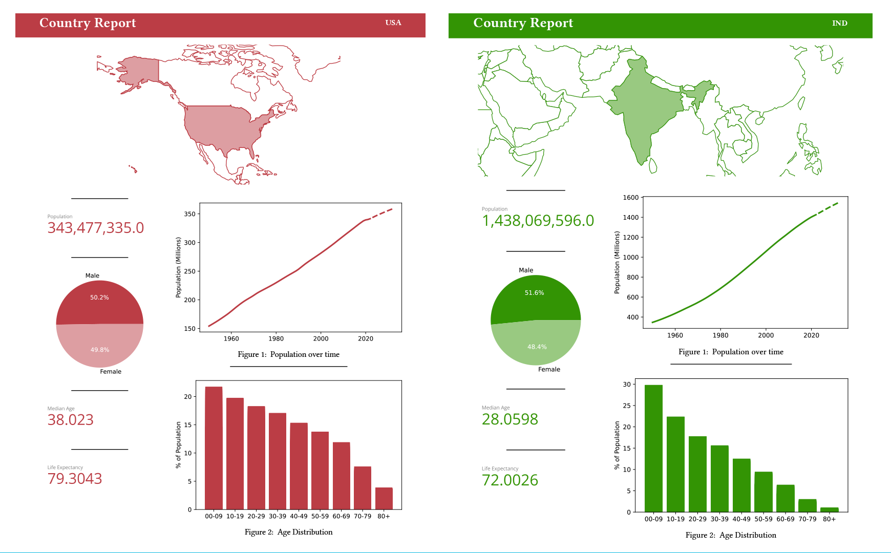

# Country Analytics Reports w/ Quarto



## Overview

Quarto is an open-source publishing system for websites, dashboards, reports, presentations, and more. This repository contains country analytics reports created with Quarto and Python.

📄 Sample Reports:  
- [Nepal](./outputs/NPL.pdf)  
- [USA](./outputs/USA.pdf)  
- [Argentina](./outputs/ARG.pdf)  

## Setup

### 1. Fork & Clone the Repository

- Fork the repo using the button in the top-right corner of this page.
- Clone the forked repo locally using:
```sh
git clone https://github.com/<YOUR USERNAME>/<YOUR REPO>.git
```
*Tip: You can also click on the green Code button to get your specific URL*

### 2. Install Required Libraries

First, [activate a virtual environment](https://docs.python.org/3/tutorial/venv.html) (optional, but recommended). Then install dependencies:
```sh
cd country-analytics  # Replace this with your name for the repo
pip install -r requirements.txt
```

### 3. Quarto Setup

- Download Quarto extensions for your preferred code editor using [this link](https://quarto.org/docs/get-started/).
- The `quarto-cli` is installed via pip, so no extra downloads should be necessary.

### 4. Generate Reports

- The report template is found in [`country_report.qmd`](./country_report.qmd)

- To generate a new report, run:
```sh
quarto render country_report.qmd
```
  This generates a PDF in the [`./outputs/`](./outputs/) directory.

- You can change the output directory by modifying the [`_quarto.yml`](./_quarto.yml) file.

- To see additional render options, use:
```sh
quarto render -h
```

### 5. Generate Multiple Reports

The script [`create_all_reports.py`](./create_all_reports.py) automates the generation of reports for multiple countries. It also uses the [colorthief library](https://github.com/fengsp/color-thief-py) to extract colors from country flags.


## Data Sources

- **United Nations**: Population, gender ratio, median age, and life expectancy we leverage the [World Populations Prospects Dataset](https://population.un.org/wpp/Download/Standard/CSV/) from the United Nations.

- **World Bank**: Age distribution data from the [World Bank World Development Indicators Database](https://databank.worldbank.org/source/world-development-indicators/preview/on). There are many additional data fields that could be incorporated into a report from this data source, but to keep the file size appropriate for a Github repository, only the age distribution indicators were kept. To easily download a more complete version of the dataset, check out this [Kaggle Dataset](https://www.kaggle.com/datasets/joebeachcapital/world-bank-country-profile).

  *Note: this Kaggle source file may be ';' delimited. If you want to load it into Pandas, you'll likely need to do a <br/>
  `pd.read_csv('worldbank-country-profile.csv', delimiter=';')`*

- **Country Flags Repository**: Find flag images from [@csmoore's repository](https://github.com/csmoore/country-flag-icons)

## Next Steps

Here are some ideas to extend and personalize your reports:

1. **Add More Data**: Integrate additional fields from the full UN or World Bank datasets.

2. **Use More Colors**: Pull multiple colors from a country’s flag using `colorthief`'s `get_palette()` function.

3. **Make Interactive Reports**: Render to HTML and use Plotly for interactive visualizations.
   
Publish your Quarto Reports by using [Posit Connect Cloud](https://pos.it/connect-keith)

## Acknowledgements

Special thanks to David Keyes and the [R for the Rest of Us](https://rfortherestofus.com/) team for the typst templates and Quarto insights. Check out David's [Posit Conf Talk](https://www.youtube.com/@PositPBC)!

---

**Share your work!** <br/>
Tag me @KeithGalli on LinkedIn or social media and use #QuartoCountry to show me your reports!
